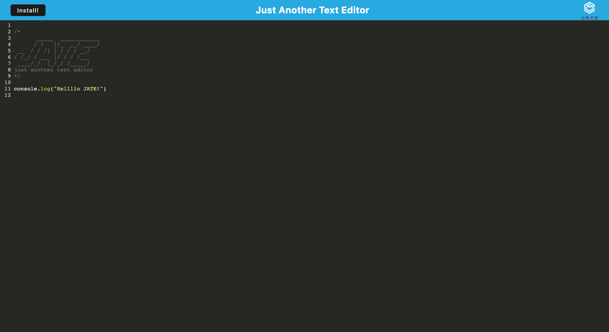

# PWA-TextEditor

## Description:
JATE, short for "Just Another Text Editor," is a Progressive Web App (PWA) that was developed as a single page application. Its purpose is to provide users with the ability to work online or offline, either by running it in a web browser or downloading it as an app.

## Table of content:
1. [Installation](#installation)
2. [Usage](#usage)
3. [Username](#username)
4. [Email](#email)

## Installation:
In order to utilize this text editor, you must first fork the repository to your local machine using git. Afterward, to install the required dependencies, execute the command: npm install.

## Usage:

Preview

## License
  None

## Github Username:
  https://github.com/DarioElao

## Email:
  darioelao@gmail.com